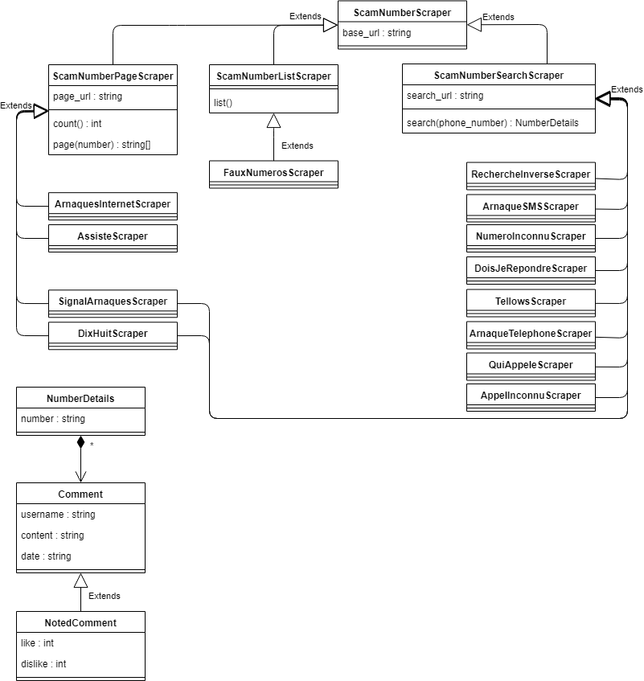

# ScamNumberScraper

## Installation

``` bash

pip install scamnumberscraper

```

## Sources

### List
-   [x] [FauxNumeros.fr](http://fauxnumeros.fr)

### Page
-   [x] [Dixhuit](http://www.dixhuit.fr)
-   [x] [Arnaques-internet](http://www.arnaques-internet.info/numero-telephone.html)
-   [x] [Signal Arnaques](https://www.signal-arnaques.com/phone-fraud)
-   [x] [Assiste](https://assiste.com/Arnaques_telephoniques/index_01.html)

### Search (details)

-   [x] [Dixhuit](http://www.dixhuit.fr)
-   [x] [ARNAQUE-SMS](https://www.arnaque-sms.com)
-   [ ] [Numero inconnu](https://www.numeroinconnu.fr)
-   [ ] [DOIS-JE REPONDRE?](https://www.doisjerepondre.fr)
-   [ ] [recherche-inverse](https://www.recherche-inverse.com)
-   [ ] [Signal Arnaques](https://www.signal-arnaques.com/phone-fraud)
-   [ ] [tellows](https://www.tellows.fr/)
-   [ ] [Arnaque-telephone](https://arnaque-telephone.com/)
-   [ ] [quiappele.fr](https://quiappele.fr/)
-   [ ] [APPELINCONNU.fr](https://appelinconnu.fr/)

## Usage

This project use many providers

### Model

For all providers, we can identify 3 kinds of provider

-   ScamNumberPageScraper : Website which use an paginator, each page presents an list of scam number
-   ScamNumberListScraper : Websute which display all scam numbers on an single page
-   ScamNumberSearchScraper : Website which use an search feature, scrape the details page to get informations like owner, list of comments, etc (depend of the provider)



### ScamNumberListScraper

``` python

import scamnumberscraper

scraper = scamnumberscraper.FauxNumerosScraper()

numbers = scraper.list()

for number in numbers:
    print(number)

"""

0796242217
0126534579
0185326870
0190005999

...

"""

```

### ScamNumberPageScraper

:boom: Make sure to make an pause between all requests like with time.sleep(), some websites can detect bot :boom:

``` python

import time

import scamnumberscraper

scraper = scamnumberscraper.DixHuitScraper()

for index in range(1, scraper.count() + 1):
    page = scraper.page(index)
    print(page)
    time.sleep(2)

"""

['0559989827', '0559989827', '0559989827', '0559989827', '0681269661', '0531483000', '0771722270', '0899566300', '0642499488', '0642499488']

...

"""

page = scraper.page(42)
print(page)

"""

['0669349263', '00359095673', '0180818903', '0706234221', '0899379624', '0805714011', '0322191813', '0495854641', '0385807285', '0141911453']

"""

```

### ScamNumberSearchScraper

``` python

import scamnumberscraper

scraper = scamnumberscraper.DixHuitScraper()

print(scraper.search("0559989827"))

"""

"""

```

## TODO

-   Fix encoding (git bash)
-   Rest of Search
-   Better NumberDetails model ?
